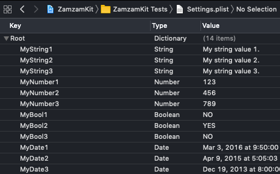

# ZamzamKit

[](https://travis-ci.org/ZamzamInc/ZamzamKit)
[](https://github.com/ZamzamInc/ZamzamKit)
[](https://swift.org)
[](https://developer.apple.com/xcode)
[](https://swift.org/package-manager)
[](https://opensource.org/licenses/MIT)

ZamzamKit is a Swift package for rapid development using a collection of micro utility extensions for Standard Library, Foundation, and other native frameworks.

## Installation

### Swift Package Manager

`.package(url: "git@github.com:ZamzamInc/ZamzamKit.git", .upToNextMajor(from: "5.1.0"))`

The `ZamzamKit` package contains four different products you can import. Add any combination of these to your target's dependencies within your `Package.swift` manifest:
```
.target(
    name: "MyAppExample",
    dependencies: [
        .product(name: "ZamzamCore", package: "ZamzamKit"),
        .product(name: "ZamzamLocation", package: "ZamzamKit"),
        .product(name: "ZamzamNotification", package: "ZamzamKit"),
        .product(name: "ZamzamUI", package: "ZamzamKit"),
    ]
)
```
*Note: This library is highly volatile and changes often to stay ahead of cutting-edge technologies. It is recommended to copy over code that you want into your own libraries or fork it.*

## ZamzamCore

### Standard+

<details>
<summary>Collection</summary>

> Get distinct elements from an array:
```swift
[1, 1, 3, 3, 5, 5, 7, 9, 9].distinct // [1, 3, 5, 7, 9]
```

> Remove an element from an array by the value:
```swift
var array = ["a", "b", "c", "d", "e"]
array.remove("c")
array // ["a", "b", "d", "e"]
```

> Easily get the array version of an array slice:
```swift
["a", "b", "c", "d", "e"].prefix(3).array
```

> Safely retrieve an element at the given index if it exists:
```swift
// Before
if let items = tabBarController.tabBar.items, items.count > 4 {
    items[3].selectedImage = UIImage("my-image")
}
```
```swift
// After
tabBarController.tabBar.items?[safe: 3]?.selectedImage = UIImage("my-image")

[1, 3, 5, 7, 9][safe: 1] // Optional(3)
[1, 3, 5, 7, 9][safe: 12] // nil
```

> Determine if a value is contained within the array of equatable values:
```swift
"b".within(["a", "b", "c"]) // true

let status: OrderStatus = .cancelled
status.within([.requested, .accepted, .inProgress]) // false
```
</details>

<details>
<summary>Dictionary</summary>

> Convert to JSON string or data:
```swift
// Before
guard let data = try? JSONSerialization.data(withJSONObject: merged, options: []),
    let log = String(data: data, encoding: .utf8) else {
        return
}

// After
guard let log = merged.jsonString else {
    return
}
```
</details>

<details>
<summary>Number</summary>

> Round doubles, floats, or any floating-point type:
```swift
123.12312421.rounded(toPlaces: 3) // 123.123
Double.pi.rounded(toPlaces: 2) // 3.14
```
</details>

<details>
<summary>String</summary>

> Create a new random string of given length:
```swift
String(random: 10) // "zXWG4hSgL9"
String(random: 4, prefix: "PIN-") // "PIN-uSjm"
```

> Safely use subscript indexes and ranges on strings:
```swift
let value = "Abcdef123456"
value[3] // "d"
value[3..<6] // "def"
value[3...6] // "def1"
value[3...] // "def123456"
value[3...99] // nil
value[99] // nil
```

> Validate string against common formats:
```swift
"test@example.com".isEmail // true
"123456789".isNumber // true
"zamzam".isAlpha // true
"zamzam123".isAlphaNumeric // true
```

> Remove spaces or new lines from both ends:
```swift
" Abcdef123456 \n\r  ".trimmed // "Abcdef123456"
```

> Truncate to a given number of characters:
```swift
"Abcdef123456".truncated(3) // "Abc..."
"Abcdef123456".truncated(6, trailing: "***") // "Abcdef***"
```

> Determine if a given value is contained:
```swift
"1234567890".contains("567") // true
"abc123xyz".contains("ghi") // false
```

> Injects a separator every nth characters:
```swift
"1234567890".separated(every: 2, with: "-") // "12-34-56-78-90"
```

> Remove the characters contained in a given set:
```swift
let string = """
    { 0         1
    2                  34
    56       7             8
    9
    }
    """

string.strippingCharacters(in: .whitespacesAndNewlines) // {0123456789}
```

> Replace the characters contained in a given character set with another string:
```swift
let set = CharacterSet.alphanumerics
    .insert(charactersIn: "_")
    .inverted

let string = """
    _abcdefghijklmnopqrstuvwxyz
    ABCDEFGHIJKLMNOPQRSTUVWXYZ
    0{1 2<3>4@5#6`7~8?9,0

    1
    """

string.replacingCharacters(in: set, with: "_") //_abcdefghijklmnopqrstuvwxyz_ABCDEFGHIJKLMNOPQRSTUVWXYZ_0_1_2_3_4_5_6_7_8_9_0__1
```

> Match using a regular expression pattern:
```swift
"1234567890".match(regex: "^[0-9]+?$") // true
"abc123xyz".match(regex: "^[A-Za-z]+$") // false
```

> Replace occurrences of a regular expression pattern:
```swift
"aa1bb22cc3d888d4ee5".replacing(regex: "\\d", with: "*") // "aa*bb**cc*d***d*ee*"
```

> Remove HTML for plain text:
```swift
"<p>This is <em>web</em> content with a <a href=\"http://example.com\">link</a>.</p>".htmlStripped // "This is web content with a link."
```

> Encoders and decoders:
```swift
value.urlEncoded()
value.urlDecoded()
value.htmlDecoded()
value.base64Encoded()
value.base64Decoded()
value.base64URLEncoded()
```

> Get an encrypted version of the string in hex format:
```swift
"test@example.com".sha256() // 973dfe463ec85785f5f95af5ba3906eedb2d931c24e69824a89ea65dba4e813b
```

> Easily get the string version of substring:
```swift
"hello world".prefix(5).string
```

> Determine if an optional string is `nil` or has no characters
```swift
var value: String? = "test 123"
value.isNilOrEmpty
```
</details>

### Foundation+

<details>
<summary>Bundle</summary>

> Get the string from a file within any bundle:
```swift
Bundle.main.string(file: "Test.txt") // "This is a test. Abc 123.\n"
```

> Get a generic array from a property list file within any bundle:

```swift
let values: [String] = Bundle.main.array(plist: "Array.plist")

values[0] // "Abc"
values[1] // "Def"
values[2] // "Ghi"
```


```swift
let values: [[String: Any]] = Bundle.main.array(plist: "Things.plist")

values[0]["id"] as? Int // 1
values[0]["name"] as? String // "Test 1"
values[0]["description"] as? String // "This is a test for 1.")

values[1]["id"] as? Int // 2)
values[1]["name"] as? String // "Test 2")
values[1]["description"] as? String // "This is a test for 2.")

values[2]["id"] as? Int // 3)
values[2]["name"] as? String // "Test 3")
values[2]["description"] as? String // "This is a test for 3.")
```


> Get a dictionary from a property list file within any bundle:
```swift
let values: [String: Any] = Bundle.main.contents(plist: "Settings.plist")

values["MyString1"] as? String // "My string value 1."
values["MyNumber1"] as? Int // 123
values["MyBool1"] as? Bool // false
values["MyDate1"] as? Date // 2018-11-21 15:40:03 +0000
```


</details>

<details>
<summary>Color</summary>

> Additional color initializers:
```swift
UIColor(hex: 0x990000)
UIColor(hex: 0x4286F4)
UIColor(rgb: (66, 134, 244))
UIColor.random
```
</details>

<details>
<summary>Currency</summary>

> A formatter that converts between numeric values and their textual currency representations:
```swift
let formatter = CurrencyFormatter()
formatter.string(fromAmount: 123456789.987) // "$123,456,789.99"

let formatter2 = CurrencyFormatter(for: Locale(identifier: "fr-FR"))
formatter2.string(fromCents: 123456789) // "1 234 567,89 €"
```
</details>

<details>
<summary>Data</summary>

> Get a hex string representation of the data:
```swift
Data()?.hexString() // 68626a4a424a6a68626a68616420663773376474663720737567796f3837545e49542a69797567
```

> Get an encrypted version of the data:
```swift
Data()?.sha256()
```
</details>

<details>
<summary>Date</summary>

> Determine if a date is in the past or future:
```swift
Date(timeIntervalSinceNow: -100).isPast // true
Date(timeIntervalSinceNow: 100).isPast // false

Date(timeIntervalSinceNow: 100).isFuture // true
Date(timeIntervalSinceNow: -100).isFuture // false
```

> Determine if a date is today, yesterday, or tomorrow:
```swift
Date().isToday // true
Date(timeIntervalSinceNow: -90_000).isYesterday // true
Date(timeIntervalSinceNow: 90_000).isTomorrow // true
```

> Determine if a date is within a weekday or weekend period:
```swift
Date().isWeekday // false
Date().isWeekend // true
```

> Get the beginning or end of the day:
```swift
Date().startOfDay // "2018/11/21 00:00:00"
Date().endOfDay // "2018/11/21 23:59:59"
```

> Get the beginning or end of the month:
```swift
Date().startOfMonth // "2018/11/01 00:00:00"
Date().endOfMonth // "2018/11/30 23:59:59"
```

> Determine if a date is current:
```swift
let date = Date(fromString: "2018/03/22 09:40")
date.isCurrentWeek
date.isCurrentMonth
date.isCurrentYear
```

> Determine if a date is between two other dates:
```swift
let date = Date()
let date1 = Date(timeIntervalSinceNow: 1000)
let date2 = Date(timeIntervalSinceNow: -1000)

date.isBetween(date1, date2) // true
```

> Determine if a date is beyond a specified time window:
```swift
let date = Date(fromString: "2018/03/22 09:40")
let fromDate = Date(fromString: "2018/03/22 09:30")

date.isBeyond(fromDate, bySeconds: 300) // true
date.isBeyond(fromDate, bySeconds: 1200) // false
```

> Use specific calendar for data manipulations:
```swift
let date = Date(fromString: "2018/03/22 09:40")
let calendar = Calendar(identifier: .chinese)

date.isToday(using: calendar)
date.isWeekday(using: calendar)
date.isCurrentMonth(using: calendar)
date.isToday(using: calendar)
date.startOfDay(using: calendar)
date.startOfMonth(using: calendar)
```

> Determine if a date is beyond a specified time window:
```swift
let date = Date(fromString: "2018/03/22 09:40")
let fromDate = Date(fromString: "2018/03/22 09:30")

date.isBeyond(fromDate, bySeconds: 300) // true
date.isBeyond(fromDate, bySeconds: 1200) // false
```

> Create a date from a string:
```swift
Date(fromString: "2018/11/01 18:15")
Date(fromString: "1440/03/01 18:31", calendar: Calendar(identifier: .islamic))
```

> Format a date to a string:
```swift
Date().string(format: "MMM d, h:mm a") // "Jan 3, 8:43 PM"
Date().string(style: .full, calendar: Calendar(identifier: .hebrew)) // "Friday, 1 Kislev 5779"
Date().string(formatter: .MM_dd_yyyy_HH_mm)
```

> Format a time interval to display as a timer.
```swift
let date = Date(fromString: "2016/03/22 09:45")
let fromDate = Date(fromString: "2016/03/22 09:40")

date.timerString(from: fromDate)

// Prints "00:05:00"
```

> Get the decimal representation of the time:
```swift
Date(fromString: "2018/10/23 18:15").timeToDecimal // 18.25
```

> Increment years, months, days, hours, or minutes:
```swift
let date = Date()
date + .years(1)
date + .months(2)
date - .days(4)
date - .hours(6)
date + .minutes(12)
date + .days(5, Calendar(identifier: .chinese))
```

> Convert between time interval units:
```swift
let diff = date.timeIntervalSince(date2) // 172,800 seconds
diff.minutes // 2,800 minutes
diff.hours // 48 hours
diff.days // 2 days
```

> Time zone context and offset:
```swift
let timeZone = TimeZone(identifier: "Europe/Paris")
timeZone?.isCurrent // false
timeZone?.offsetFromCurrent // -21600
```

> Normalize date calculations and data storage:
```swift
let timeZone: TimeZone = .posix // GMT
let locale: Locale = .posix // en_US_POSIX
```
</details>

<details>
<summary>Decodable</summary>

> Get a value of the type you specify, decoded from a JSON string.
```swift
let jsonString = "{\"test1\":29,\"test2\":62,\"test3\":33,\"test4\":24,\"test5\":14,\"test6\":72}"
let jsonObject: [String: Int] = jsonString.decode()

// Result
[
    "test1": 29,
    "test2": 62,
    "test3": 33,
    "test4": 24,
    "test5": 14,
    "test6": 72
]
```

> Get a type-erased `Decodable` value:
```swift
let json = """
{
    "boolean": true,
    "integer": 1,
    "double": 3.14159265358979323846,
    "string": "Abc123",
    "date": "2018-12-05T15:28:25+00:00",
    "array": [1, 2, 3],
    "nested": {
        "a": "alpha",
        "b": "bravo",
        "c": "charlie"
    }
}
""".data(using: .utf8)

let decoder = JSONDecoder()
let dictionary = try decoder.decode([String: AnyDecodable].self, from: json)

dictionary["boolean"].value // true
dictionary["integer"].value // 1
dictionary["string"].value // Abc123
```

> Skip failed elements during decoding instead exiting collection completely; lossy array decoding.
```swift
init(from decoder: Decoder) throws {
    let container = try decoder.container(keyedBy: CodingKeys.self)
    
    self.authors = try container.decode(FailableCodableArray<Author>.self, forKey: .author)
}
```
</details>

<details>
<summary>DispatchQueue</summary>

> Provides configured queues for executing commonly related work items:
```swift
DispatchQueue.database.async {
    // Database work here
}

DispatchQueue.transform.async {
    // Parse or decode work here
}

DispatchQueue.logger.async {
    // Logging work here
}
```
</details>

<details>
<summary>FileManager</summary>

> Get URL or file system path for a file:
```swift
FileManager.default.url(of: fileName, from: .documentDirectory)
FileManager.default.path(of: fileName, from: .cachesDirectory)
```

> Get URL or file system paths of files within a directory:
```swift
FileManager.default.urls(from: .documentDirectory)
FileManager.default.paths(from: .downloadsDirectory)
```

> Retrieve a file remotely and persist to local disk:
```swift
FileManager.default.download(from: "http://example.com/test.pdf") { url, response, error in
    // The `url` parameter represents location on local disk where remote file was downloaded.
}
```
</details>

<details>
<summary>Location</summary>

> Get the location details for coordinates:
```swift
CLLocation(latitude: 43.6532, longitude: -79.3832).geocoder { meta in
    print(meta.locality)
    print(meta.country)
    print(meta.countryCode)
    print(meta.timezone)
    print(meta.administrativeArea)
}
```

> Get the closest or farthest location from a list of coordinates:
```swift
let coordinates = [
    CLLocationCoordinate2D(latitude: 43.6532, longitude: -79.3832),
    CLLocationCoordinate2D(latitude: 59.9094, longitude: 10.7349),
    CLLocationCoordinate2D(latitude: 35.7750, longitude: -78.6336),
    CLLocationCoordinate2D(latitude: 33.720817, longitude: 73.090032)
]

coordinates.closest(to: homeCoordinate)
coordinates.farthest(from: homeCoordinate)
```

> Determine if location services is enabled and authorized for always or when in use:
```swift
CLLocationManager.isAuthorized // bool
```
</details>

<details>
<summary>URL</summary>

> Append a query string parameter to a URL:
```swift
let url = URL(string: "https://example.com?abc=123&lmn=tuv&xyz=987")
url?.appendingQueryItem("def", value: "456") // "https://example.com?abc=123&lmn=tuv&xyz=987&def=456"
url?.appendingQueryItem("xyz", value: "999") // "https://example.com?abc=123&lmn=tuv&xyz=999"
```

> Append a dictionary of query string parameters to a URL:
```swift
let url = URL(string: "https://example.com?abc=123&lmn=tuv&xyz=987")
url?.appendingQueryItems([
    "def": "456",
    "jkl": "777",
    "abc": "333",
    "lmn": nil
]) // "https://example.com?xyz=987&def=456&abc=333&jkl=777"
```

> Remove a query string parameter to a URL:
```swift
let url = URL(string: "https://example.com?abc=123&lmn=tuv&xyz=987")
url?.removeQueryItem("xyz") // "https://example.com?abc=123&lmn=tuv"
```

> Query a URL from a parameter name:
```swift
let url = URL(string: "https://example.com?abc=123&lmn=tuv&xyz=987")
url?.queryItem("aBc") // "123"
url?.queryItem("lmn") // "tuv"
url?.queryItem("yyy") // nil
```
</details>

<details>
<summary>URLSession</summary>

> A thin wrapper around `URLSession` and `URLRequest` for simple network requests:
```swift
let request = URLRequest(
    url: URL(string: "https://httpbin.org/get")!,
    method: .get,
    parameters: [
        "abc": 123,
        "def": "test456",
        "xyz": true
    ],
    headers: [
        "Abc": "test123",
        "Def": "test456",
        "Xyz": "test789"
    ]
)
 
let networkManager = NetworkManager(
    service: NetworkFoundationService()
)

networkManager.send(with: request) { result in
    switch result {
    case let .success(response):
        response.data
        response.headers
        response.statusCode
    case let .failure(error):
        error.statusCode
    }
}
```
Or call multiple URL requests simultaneously:
```swift
let request1 = URLRequest(
    url: URL(string: "https://httpbin.org/get")!,
    method: .get
)

let request2 = URLRequest(
    url: URL(string: "https://httpbin.org/post")!,
    method: .post
)

let request3 = URLRequest(
    url: URL(string: "https://httpbin.org/delete")!,
    method: .delete
)

networkManager.send(requests: request1, request2, request3) { firstResult, anotherResult, otherResult in
    switch firstResult {
    case let .success(response):
        response.data
    case let .failure(error):
        error.statusCode
    }

    switch anotherResult {
    case let .success(response):
        response.data
    case let .failure(error):
        error.statusCode
    }
    
    switch otherResult {
    case let .success(response):
        response.data
    case let .failure(error):
        error.statusCode
    }
}
```

> Use an adapter to intercept any `URLRequest` and modify for all network requests:
```swift
struct CustomURLRequestAdapter: URLRequestAdapter {
        
    func adapt(_ request: URLRequest) -> URLRequest {
        var request = request
        request.setValue("1", forHTTPHeaderField: "X-Test-1")
        request.setValue("2", forHTTPHeaderField: "X-Test-2")
        return request
    }
}

let request = URLRequest(
    url: URL(string: "https://httpbin.org/get")!,
    method: .get
)
 
let networkManager = NetworkManager(
    service: NetworkFoundationService(),
    adapter: CustomURLRequestAdapter()
)

networkManager.send(with: request) { result in
    guard case let .success(response) else { return }

    request.value(forHTTPHeaderField: "X-Test-1") == nil // true
    request.value(forHTTPHeaderField: "X-Test-2") == nil // true

    response.request.value(forHTTPHeaderField: "X-Test-1") == "1" // true
    response.request.value(forHTTPHeaderField: "X-Test-2") == "2" // true
}
```
</details>

### Utilities

<details>
<summary>AppInfo</summary>

> Get details of the current app:
```swift
struct SomeStruct: AppInfo {

}

let someStruct = SomeStruct()

someStruct.appDisplayName // "Zamzam App"
someStruct.appBundleID // "io.zamzam.app"
someStruct.appVersion // "1.0.0"
someStruct.appBuild // "23"
someStruct.isInTestFlight // false
someStruct.isRunningOnSimulator // false
```
</details>

<details>
<summary>Apply</summary>

> Set properties with closures just after initializing:
```swift
let paragraph = NSMutableParagraphStyle().apply {
    $0.alignment = .center
    $0.lineSpacing = 8
}

let label = UILabel().apply {
    $0.textAlignment = .center
    $0.textColor = UIColor.black
    $0.text = "Hello, World!"
}

UITabBar.appearance().apply {
    $0.barStyle = .dark
    $0.tintColor = .blue
}
```
</details>

<details>
<summary>Atomic</summary>

> A thread-safe value that handles concurrent reads and writes ([read more](https://basememara.com/creating-thread-safe-generic-values-in-swift/)):
```swift
var temp = Atomic<Int>(0)

DispatchQueue.concurrentPerform(iterations: 1_000_000) { index in
temp.value { $0 += 1 }
}

XCTAssertEqual(temp.value, 1_000_000) // true
```
</details>

<details>
<summary>AppMigration</summary>

> Manages blocks of code that only need to run once on version updates in apps:
```swift
@UIApplicationMain
class AppDelegate: UIResponder, UIApplicationDelegate {

    var window: UIWindow?
    let migration = AppMigration()

    func application(_ application: UIApplication, willFinishLaunchingWithOptions launchOptions: [UIApplication.LaunchOptionsKey: Any]? = nil) -> Bool {
        migration
            .performUpdate {
                print("Migrate update occurred.")
            }
            .perform(forVersion: "1.0") {
                print("Migrate to 1.0 occurred.")
            }
            .perform(forVersion: "1.7") {
                print("Migrate to 1.7 occurred.")
            }
            .perform(forVersion: "2.4") {
                print("Migrate to 2.4 occurred.")
            }
            
        return true
    }
}
```
</details>

<details>
<summary>BackgroundTask</summary>

> Easily execute a [long-running background task](https://developer.apple.com/documentation/uikit/uiapplication/1623031-beginbackgroundtask):
```swift
BackgroundTask.run(for: application) { task in
    // Perform finite-length task...
    task.end()
}
```
</details>

<details>
<summary>Keychain</summary>

> A thin wrapper to manage Keychain, or other services that conform to `KeychainService`:
```swift
let keychain = KeychainManager(
    service: KeychainExternalService()
)

keychain.set("kjn989hi", forKey: .token)

keychain.get(.token) {
    print($0) // "kjn989hi"
}

// Define strongly-typed keys
extension KeychainAPI.Key {
    static let token = KeychainAPI.Key("token")
}
```
</details>

<details>
<summary>Logger</summary>

> Create loggers that conform to `LogService` and add to `LogManager` (console and `os_log` are included):
```swift
let log = LogManager(
    services: [
        LogServiceConsole(minLevel: .debug),
        LogServiceOS(
            minLevel: .warning,
            subsystem: "io.zamzam.Basem-Emara",
            category: "Application"
        ),
        MyCustomLogger()
    ]
)

log.error("There was an error.")
```
</details>

<details>
<summary>SystemConfiguration</summary>

> Determine if the device is connected to a network:
```swift
import SystemConfiguration

SCNetworkReachability.isOnline
```
</details>

### Infixes

<details>
<summary>ConditionalAssignment ?=</summary>

> Assign a value if not nil:
```swift
var test: Int? = 123
var value: Int? = nil

test ?= value
// test == 123

value = 456
test ?= value
// test == 456
```
</details>

<details>
<summary>NilOrEmptyAssignment ??+</summary>

> Assign a value if not nil or empty:
```swift
var test: String
var value: String?

test = value ??+ "Abc"
// test == "Abc"

value = ""
test = value ??+ "Lmn"
// test == "Lmn"

value = "Xyz"
test = value ??+ "Rst"
// test == "Xyz"
```
</details>

## ZamzamLocation

<details>
<summary>LocationManager</summary>

> Location manager that offers `Combine` wrappers:
```swift

func fetchLocation() {
    log.debug("Begin location authorization...")

    guard locationManager.isAuthorized else {
        locationManager.requestAuthorization()
            .handleEvents(receiveOutput: { [weak self] granted in
                guard granted else {
                    self?.log.error("Location authorization denied")
                    return
                }

                self?.log.debug("Location authorization granted")
            })
            .first { $0 }
            .sink { [weak self] _ in self?.fetchLocation() }
            .store(in: &cancellable)

        return
    }

    log.debug("Begin fetching location...")

    locationManager
        .startUpdatingLocation()
        .retry(3)
        .catch { [weak self] error -> AnyPublisher<CLLocation, Never> in
            self?.log.error("GPS location coordinate failed", error: error)
            return Empty(completeImmediately: true).eraseToAnyPublisher()
        }
        .first()
        .sink { [weak self] in
            self?.log.debug("Location coordinate: \($0)")
            self?.locationManager.stopUpdatingLocation()
            self?.log.debug("Location turned off GPS")
        }
        .store(in: &cancellable)
}
```
</details>

## ZamzamNotification

<details>
<summary>UserNotification</summary>

> Registers the local and remote notifications with the categories and actions it supports:
```swift
UNUserNotificationCenter.current().register(
    delegate: self,
    categories: [
        "order": [
            UNNotificationAction(
                identifier: "confirmAction",
                title: "Confirm",
                options: [.foreground]
            )
        ],
        "chat": [
            UNTextInputNotificationAction(
                identifier: "replyAction",
                title: "Reply",
                options: [],
                textInputButtonTitle: "Send",
                textInputPlaceholder: "Type your message"
            )
        ],
        "offer": nil
    ],
    authorizations: [.alert, .badge, .sound],
    completion: { granted in
        granted
            ? log.debug("Authorization for notification succeeded.")
            : log.warn("Authorization for notification not given.")
    }
)
```

> Get a list of all pending or delivered user notifications:
```swift
UNUserNotificationCenter.current().getNotificationRequests { notifications in
    notifications.forEach {
        print($0.identifier)
    }
}
```

> Find the pending or delivered notification request by identifier:
```swift
UNUserNotificationCenter.current().get(withIdentifier: "abc123") {
    print($0?.identifier)
}

UNUserNotificationCenter.current().get(withIdentifiers: ["abc123", "xyz789"]) {
    $0.forEach {
        print($0.identifier)
    }
}
```

> Determine if the pending or delivered notification request exists:
```swift
UNUserNotificationCenter.current().exists(withIdentifier: "abc123") {
    print("Does notification exist: \($0)")
}
```

> Schedules local notifications for delivery:
```swift
UNUserNotificationCenter.current().add(
    body: "This is the body for time interval",
    timeInterval: 5
)

UNUserNotificationCenter.current().add(
    body: "This is the body for time interval",
    title: "This is the snooze title",
    timeInterval: 60,
    identifier: "abc123-main"
)

UNUserNotificationCenter.current().add(
    body: "This is the body for time interval",
    title: "This is the misc1 title",
    timeInterval: 60,
    identifier: "abc123-misc1",
    category: "misc1Category"
)

UNUserNotificationCenter.current().add(
    body: "This is the body for time interval",
    title: "This is the misc2 title",
    timeInterval: 60,
    identifier: "abc123-misc2",
    category: "misc2Category",
    userInfo: [
        "id": post.id,
        "link": post.link,
        "mediaURL": mediaURL
    ],
    completion: { error in
        guard error == nil else { return }
        // Added successfully
    }
)

UNUserNotificationCenter.current().add(
    date: Date(timeIntervalSinceNow: 5),
    body: "This is the body for date",
    repeats: .minute,
    identifier: "abc123-repeat"
)
```

> Get a remote image from the web and convert to a user notification attachment:
```swift
UNNotificationAttachment.download(from: urlString) {
    guard case let .success(attachment) = $0 else {
        log.error("Could not download the remote resource (\(urlString)): \($0.error?.debugDescription).")
        return
    }

    UNUserNotificationCenter.current().add(
        body: "This is the body",
        attachments: [attachment]
    )
}
```

> Remove pending or delivered notification requests by identifiers, categories, or all:
```swift
UNUserNotificationCenter.current().remove(withIdentifier: "abc123")
UNUserNotificationCenter.current().remove(withIdentifiers: ["abc123", "xyz789"])
UNUserNotificationCenter.current().remove(withCategory: "chat") { /* Done */ }
UNUserNotificationCenter.current().remove(withCategories: ["order", "chat"]) { /* Done */ }
UNUserNotificationCenter.current().removeAll()
```
</details>

## ZamzamUI

### SwiftUI

<details>
<summary>Documentation coming soon!</summary>

>Extensions
>Modifiers
>Styles
>Views
</details>


### WatchKit

<details>
<summary>CLKComplicationServer</summary>

> Invalidates and reloads all timeline data for all complications:
```swift
// Before
guard let complications = activeComplications, !complications.isEmpty else { return }
complications.forEach { reloadTimeline(for: $0) }
```
```swift
// After
CLKComplicationServer.sharedInstance().reloadTimelineForComplications()
```

> Extends all timeline data for all complications:
```swift
// Before
guard let complications = activeComplications, !complications.isEmpty else { return }
complications.forEach { extendTimeline(for: $0) }
```
```swift
// After
CLKComplicationServer.sharedInstance().extendTimelineForComplications()
```
</details>

## Author

* Basem Emara, https://zamzam.io

## License

`ZamzamKit` is available under the MIT license. See the [LICENSE](https://github.com/ZamzamInc/ZamzamKit/blob/master/LICENSE) file for more info.
